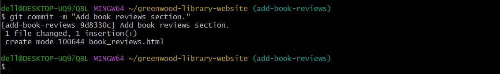

# Introduction To A Git Project. #

## Capstone Project: Enhancing a Community Library Website. ##

Before going into the real project, what do we even understand by Git? what does it mean? wjat does it do? is it like an item, or a machine, or a computer?. Let's dwell into what Git is all about in a very short form.

## What is Git? ##

By far, the most widely used modern version control system in the world today is Git. Git is a mature, actively maintained open source project originally developed in 2005 by Linus Torvalds, the famous creator of the Linux operating system kernel. Developers who have worked with Git are well represented in the pool of available software development talent and it works well on a wide range of operating systems.
In order not to have enormous infos, the only limited types of Git you should know for now is GitHub and Gitbash (terminal).

### Background Scenario ###

You're part of a development team tasked with enhancing the website for the **Greenwood Community Library.** The website aims to be more engaging and informative for its visitors. It currently includes basic sections: **Home, About Us, Events, and Contact Us.**
Your team decides to add a **"Book Reviews"** section and update the
**"Events"** page to feature upcoming community events.

You will simulate the roles of two contributors: **"Morgan"** and **"Jamie".** Morgan will focus on adding the **"Book Reviews"** section, while Jamie will update the **"Events"** page with new community events.

### Objectives ###
* Practice cloning a repository and working with branches in Git.
* Gain experience in staging, committing, and pushing changes from both developers.
* Create pull requests and merge them after resolving any potential conflicts.

### Creation of a repository on GitHub. ###
Before we can commence to anything on this project, we need to ascertain a creation of a repository on GitHub to work on, this is more like you creating an account to save or store things into. And how do we do that is as it is shown below;

### Setup ##
**1. Create a repository on GitHub.**

How to do that is just like a piece of cake, after you have your GitHub on your system, you go ahead and open/run the app and  click on the 3 lines icon at the top right of the dashboard.

The next step here is to click on **Home**, since we're just creating a new repository, then we will need to click on the **New** option, as it's shown in the images below.

We've been mentioning and talking about **"Repository"** without letting  us know what it is about.

In simplicity, Repository is known as the most basic element of GitHub. It's a place where you can store your code, your files, and each file's revision history. Repositories can have multiple collaborators and can be either public, internal, or private.

The next step is to click on "New" to dive into the creation of the repository.
You can name it any title of your choice but according to what we're working on with given instructions, we're to name it **"greenwood-library-website"**. 
The description aspect is optional, it can be skipped if you want or the otherwise by describing it as your choice of title. 
The next segment is where you choose if your repository to be public or private, but i'd advice it to be in public for other collaborator to have an access to your files remotely.
Furthermore, you'd need to initialize your repository with **"README"** as instructed in what we're working on.
Lastly, click on **"create repository"** right below the page.

This is how your repository should display after you've successfully created it. 

### Tasks ###
1. **In the main branch, using Visual Studio Code editor ensure there are   files for each of the web pages.**
* home.html
* about_us.html
* events.html
* contact_us.html

In the main branch of the new repository, we need to use Visual Studio Code (VSC) editorto create some files.
VSC  isa public extensibility model that lets developers build and use extensions, and richly customize their edit-build-debug experience.

In order to have this done, this is where ***"Clone"*** comes in.
Clone is an act of taking a repository on a server like your github and copy/download it to your computer interface machine.
it is sometimes related to the 2 terms called push and pull.

So therefore, how do we clone? We'd need the *URL* of our repositry, you'd need to go to the last surface we displayed on our GitHub, and then we click on *code*, using the SSH url is a bit complicated as a novice and not necessary right now, so then we copy the url of our HTTPS , as it is displayed below.

Furthermore, you'd need to open up your terminal on any local machine of your choice that you're familiar with. You'll be seeing Gitbash local machine a lot on this project, it's because that's what I'm much more familiar with, of which I'll also advise you should use Gitbash.
We'd be running a lot of commands onour terminal, since we're cloning for now, we'd make use of  this command `git clone`, and then we paste the url we copied, just as it's displayed below,

When you hit enter, you should get the displayed image below on your terminal.

It'd take few minutes for it to clone on your local machine depending on how much files you have in your repository. 
 After the cloning is being processed successfully, you'd need to run the next command to check your repository on local desktop which is `start .`

 

You'd go ahead to open your repository folder to see the README file you initialized with your repository while you were creating it.

Since we've being instructed to  make use of VSC to ensure some files, we need to work on our files creation via VSC editor. There're so many ways to do this, but i do prefer to use this process because it's simplicity and less complications, by dragging the repository directly to your VSC just like the image below,

Then your VSC start up should open like this

We move ahead to create instructed files on our VSC editor machine by clicking +file as it's shown below,

SInce we're creating a new file, then we'd need to click on the *"New file"* from the options and name our files according to the task.
CErtainly, we'd go through the same peocess to create all the files.

2. **Add any random content into each of the files.**

As instructed, we shouldn't leave the files we created empty, we ought to add sme content of your choice e.g texts.

3. **Stage, commit and push the changes directly to the ***main*** branch. (This is a simulation of the team's existing code base for the website)

Before going further, since the main focus of this project is on Git and not on any specific programming language. We need to know some  important terms which are:

**Staging and Committing the code**

Committing is the process in which the code is added to the local repository. Before committing the code, it has to be in the staging area. The staging area is there to keep track of all the files which are to be committed.
Any file which is not added to the staging area will not be committed. This gives the developer control over which files need to be committed.

**Staging**
Use the following command for staging the file:
`git add demo.txt`

In case you want to add multiple files you can use:
`git add file1 file2 file3`

If you want to add all the files inside your project folder to the staging area, use the following command:

`git add .`

Use this carefully since it adds all the files and folders in your project to the staging area.

**Committing**
Use the following command to commit the file:
`git commit -m "Initial Commit"`
*“Initial Commit”* is the commit message here. Enter a relevant commit message to indicate what code changes were done in that particular commit.

**Git Status**
Use `git status` to find out information regarding what files are modified and what files are there in the staging area — it shows other information as well, which we can ignore for now.

Use the following command to see the status:
The status shows that `demo.txt` is modified and is not yet in the staging area.

Now let us add `demo.txt` to the staging area and commit it using the following commands:

`git add demo.txt git commit -m "demo.txt file is modified"`

Continuing our on-going project, we need to go to uoor local machine terminal  and run `cd` command to go into the folder we have our repository and also check the status of git as it's shown below in the image:

You can see in the previous image above that after we used the `git status` command, we got to know the files that are untracked  and need to be committed.
So therefore, this is where the `git add`  and `git commit -m` command comes in,

You'd notice the files have turned to green color, that indicates they've all been added for committing.

According to the given tasks, the next step is to push all the changes we've had so far directly to the main branch. What does branch or main branch means?

A branch is nothing but a pointer to the latest commit in the Git repository. So currently our branch is *main* because the default branch on GitHub is *main branch*, and remember we created our repository on GitHub and not on our terminal.

Besides any other created branches manually, there's another branch called *master branch* which is a pointer to the second commit `demo.txt file is modified`.

Why are multiple branches needed?
Multiple branches are needed to support multiple parallel developments. Refer the image below to see how branches work.

The command to get the list of  all the branches is `git branch`

Now, we need to push to our main, i.e to our remote repository with the command `git push origin`, just as it's shown below image,

## Morgan's Work: Adding Book Reviews ##
1. Create a Branch for Morgan:
Command to use for branch creation and to switch instantly to the new branch created is `git branch <name>`

2. Switch to a new branch names ***add-book-reviews.***

3. Add a new file ***book-reviews-html*** to represent the Book Reviews Section:

4. Add a random text content into the file.
The command for this is `echo "text"`

You'd notice a strange command attached to the command for adding text/content into a file which is `>"file name"` which indicates the creation of a file as No 2. Morgans's work instructed.

5. Stage, Commit, and Push Changes with a message like ***"Add book reviews section."***

6. Push the ***add-book-reviews*** branch to GitHub.

7. Raise a PR for Morgan's work.

A pull request, often abbreviated as PR, serves as a proposal to merge changes made in one branch of a repository into another, typically from a feature branch into the main branch. Pull requests are essential for facilitating code reviews, encouraging collaboration, and maintaining a clean, well-documented codebase.

We've had enough of the terminal, I think it's time we go check on how our repository on GitHub bis doing and looking like after all engine rough work we've done on our terminal, and we will head on to raise a PR for Morgan's work.

To raise a PR, we nedd to click on ***compare & pull request***, if you check the left adjacent to the ***compare & pull request***, you'd see it has the message that the branch that was created had recently pushed just like we did on the terminal.

The next page you'd be taken to is where you add description to the raised PR and click on as the arrow indicated, just as it's displayed in the image below, 

8. Merge Morgan's work to the main branch.

## Jamie's Work: Updating Events Page ##
Repeat the same flow for Jamiee's work on Events Page. Ensure Jamie's work is in *update-events* branch.

* Pull the latest changes from the main branch intp *update-events* before raising the PR.

